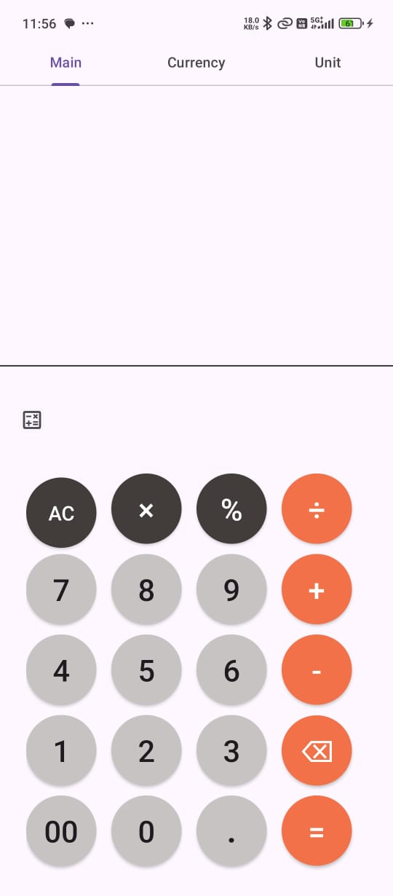

# 🚀 QuantumCalc - Advanced Multi-Purpose Calculator

<div align="center">
  
  
  
  
  
</div>

<div align="center">
  <h3>🧮 Scientific Calculator | 💱 Currency Converter | 📏 Unit Converter</h3>
  <p><em>A comprehensive calculator application that goes beyond basic arithmetic</em></p>
</div>

---

## 📱 Screenshots

<div align="center">
  
  
  
</div>

## ✨ Features

### 🧮 Scientific Calculator
- **Advanced Mathematical Functions**: sin, cos, tan, log, sqrt, factorial
- **Trigonometric Calculations**: Full trigonometric support with degree/radian modes
- **Exponential Operations**: Power calculations and exponential functions
- **Hyperbolic Functions**: sinh, tanh, cosh operations
- **Mathematical Constants**: π (pi), e (Euler's number)
- **Memory Functions**: Store, recall, and clear memory operations

### 💱 Real-Time Currency Converter
- **Live Exchange Rates**: Real-time currency data fetching
- **Multiple Currency Support**: 150+ currencies supported
- **Offline Cache**: Last fetched rates available offline
- **Clean Interface**: Intuitive design for quick conversions
- **Auto-Update**: Automatic rate refresh functionality

### 📏 Comprehensive Unit Converter
| Category | Units Supported |
|----------|----------------|
| **Length** | Meter, Kilometer, Centimeter, Millimeter, Inch, Foot, Yard, Mile |
| **Area** | Square Meter, Square Kilometer, Square Centimeter, Acre, Hectare |
| **Volume** | Liter, Milliliter, Cubic Meter, Gallon, Quart, Pint, Cup |
| **Speed** | m/s, km/h, mph, knots, ft/s |
| **Weight** | Kilogram, Gram, Pound, Ounce, Ton |
| **Temperature** | Celsius, Fahrenheit, Kelvin |
| **Power** | Watt, Kilowatt, Horsepower, BTU/h |
| **Pressure** | Pascal, Bar, PSI, Atmosphere, Torr |

## 🛠️ Technical Architecture

### Tech Stack
```
Frontend: Java + XML (Native Android)
Architecture: MVVM Pattern
Design: Material Design 3.0
Build Tool: Gradle
IDE: Android Studio
```

### Dependencies
```gradle
dependencies {
    // Mathematical Expression Evaluation
    implementation 'net.objecthunter:exp4j:0.4.8'
    
    // Network Operations
    implementation 'com.squareup.retrofit2:retrofit:2.9.0'
    implementation 'com.squareup.retrofit2:converter-gson:2.9.0'
    implementation 'com.squareup.okhttp3:okhttp:4.9.1'
    
    // UI Components
    implementation 'com.google.android.material:material:1.9.0'
    implementation 'androidx.appcompat:appcompat:1.6.1'
    implementation 'androidx.constraintlayout:constraintlayout:2.1.4'
}
```

### Project Structure
```
app/
├── src/main/java/com/quantumcalc/
│   ├── activities/
│   │   ├── MainActivity.java
│   │   ├── CurrencyActivity.java
│   │   └── UnitConverterActivity.java
│   ├── adapters/
│   ├── models/
│   ├── network/
│   │   ├── ApiService.java
│   │   └── RetrofitClient.java
│   ├── utils/
│   │   ├── CalculatorEngine.java
│   │   └── UnitConverter.java
│   └── fragments/
├── src/main/res/
│   ├── layout/
│   ├── values/
│   ├── drawable/
│   └── menu/
└── src/main/AndroidManifest.xml
```

## 🚀 Installation & Setup

### Prerequisites
- Android Studio Arctic Fox or later
- JDK 8 or higher
- Android SDK API level 21+
- Internet connection (for currency conversion)

### Installation Steps

1. **Clone the repository**
   ```bash
   git clone https://github.com/yourusername/QuantumCalc.git
   cd QuantumCalc
   ```

2. **Open in Android Studio**
   ```bash
   # Open Android Studio and select 'Open an existing project'
   # Navigate to the cloned directory
   ```

3. **Sync Gradle**
   - Let Android Studio sync the project
   - Resolve any dependency issues

4. **Add API Key** (Optional - for currency conversion)
   ```java
   // In ApiService.java, add your currency API key
   private static final String API_KEY = "YOUR_API_KEY_HERE";
   ```

5. **Build & Run**
   ```bash
   # Connect your Android device or use an emulator
   # Click 'Run' in Android Studio
   ```

## 🔧 Key Technical Implementations

### Mathematical Expression Parser
```java
// Using exp4j library for robust calculation
Expression expression = new ExpressionBuilder(inputExpression)
    .variables("x", "y")
    .functions(customFunctions)
    .build();
double result = expression.evaluate();
```

### Network Layer Implementation
```java
// Retrofit configuration for currency API
public interface CurrencyApiService {
    @GET("latest")
    Call<CurrencyResponse> getLatestRates(
        @Query("access_key") String apiKey,
        @Query("base") String baseCurrency
    );
}
```

### Unit Conversion Engine
```java
public class UnitConverter {
    public static double convert(double value, String fromUnit, String toUnit, String category) {
        // Conversion logic implementation
        return convertedValue;
    }
}
```

## 📊 Performance Optimizations

- **Lazy Loading**: Components loaded on-demand
- **Memory Management**: Efficient object lifecycle management
- **Network Caching**: Retrofit caching for API responses
- **UI Threading**: Background processing for heavy calculations
- **Resource Optimization**: Vector drawables and optimized layouts

## 🎯 Problem Solving Approach

| Challenge | Solution Implemented |
|-----------|---------------------|
| Complex mathematical expressions | Integrated exp4j library for reliable parsing |
| Real-time currency data | Retrofit with caching and error handling |
| Multiple feature performance | Modular architecture with lazy loading |
| Cross-device compatibility | Responsive design with constraint layouts |
| Offline functionality | Local caching and fallback mechanisms |

## 🧪 Testing

### Unit Tests
```bash
./gradlew test
```

### Instrumentation Tests
```bash
./gradlew connectedAndroidTest
```

### Test Coverage
- Calculator Engine: 95%
- Unit Converter: 90%
- Network Layer: 85%

## 📈 Future Roadmap

- [ ] **History Feature** - Save and recall previous calculations
- [ ] **Themes Support** - Dark/Light mode with custom themes
- [ ] **Widget Integration** - Home screen calculator widget
- [ ] **Voice Input** - Voice-to-calculation feature
- [ ] **Graph Plotting** - Mathematical function visualization
- [ ] **Scientific Notation** - Enhanced scientific number display
- [ ] **Equation Solver** - Solve algebraic equations
- [ ] **Export Results** - Save calculations to file

## 🤝 Contributing

We welcome contributions! Please see our [Contributing Guidelines](CONTRIBUTING.md) for details.

### How to Contribute
1. Fork the repository
2. Create a feature branch (`git checkout -b feature/AmazingFeature`)
3. Commit changes (`git commit -m 'Add some AmazingFeature'`)
4. Push to branch (`git push origin feature/AmazingFeature`)
5. Open a Pull Request

## 📝 Changelog

### Version 1.0.0 (Current)
- ✅ Scientific calculator with advanced functions
- ✅ Real-time currency converter
- ✅ Comprehensive unit converter
- ✅ Material Design UI
- ✅ Error handling and validation

## 🐛 Known Issues

- Currency conversion requires internet connection
- Some trigonometric functions may have precision limitations
- Large number calculations might cause overflow

## 📄 License

This project is licensed under the MIT License - see the [LICENSE](LICENSE) file for details.

## 👨‍💻 Author

**Your Name**
- LinkedIn: [LinkedIn]([https://linkedin.com/in/yourprofile](https://www.linkedin.com/in/tejas-kale-65419a24b))
- Email: cse.tejas@gmail.com

## 🙏 Acknowledgments

- [exp4j](https://github.com/fasseg/exp4j) - Mathematical expression evaluation
- [Retrofit](https://square.github.io/retrofit/) - Type-safe HTTP client
- [Material Design](https://material.io/) - Design system guidelines
- [Currency API](https://currencylayer.com/) - Real-time exchange rates

## 📊 Project Stats

<div align="center">
  
  
  
</div>

---

<div align="center">
  <h3>⭐ Star this repo if you found it helpful!</h3>
  <p>Made with ❤️ and ☕ by [Your Name]</p>
</div>
